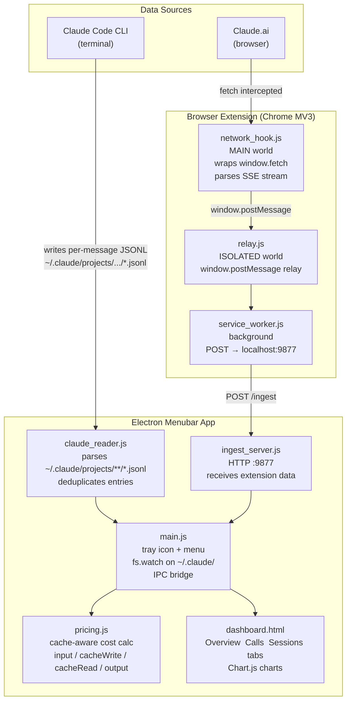
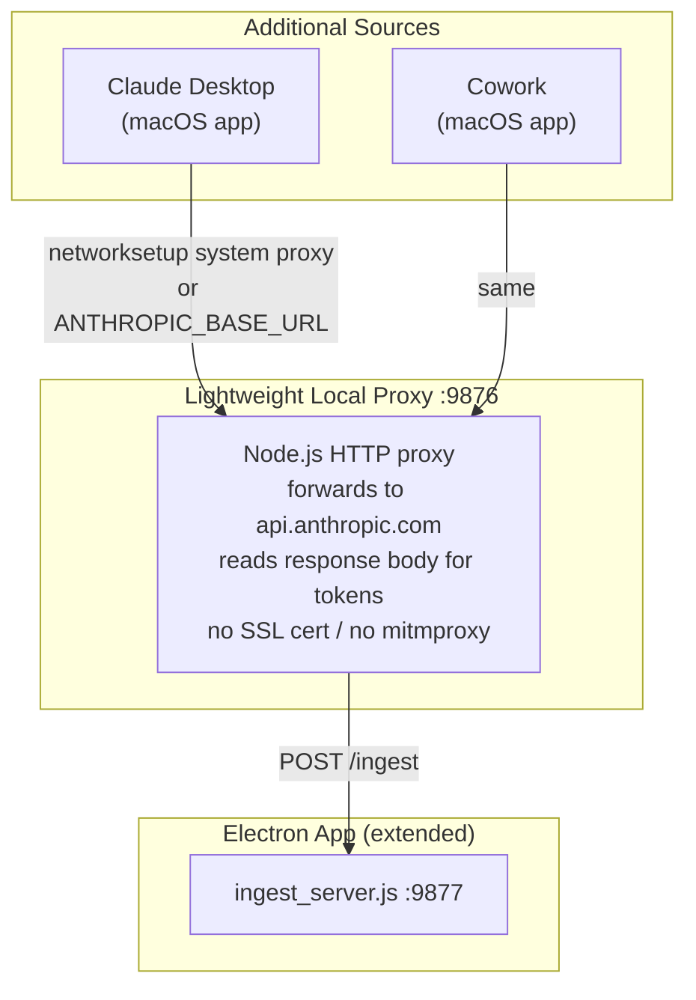

# Claude Usage Tracker — Architecture

## Phase 1 (current)



## Phase 2 (planned)



## Token cost model

| Token type | How it arises | Pricing (Sonnet 4.6) |
|---|---|---|
| `input_tokens` | Fresh text not in cache | $3.00 / MTok |
| `cache_creation_input_tokens` | Building a new cache entry | $3.75 / MTok |
| `cache_read_input_tokens` | Reading from existing cache | $0.30 / MTok |
| `output_tokens` | Model response | $15.00 / MTok |

Cache reads are 10x cheaper than input. Claude Code uses prompt caching heavily — most tokens in a long session are cheap cache reads.

## Key files

```
claude-usage-tracker/
├── src/
│   ├── main.js            Electron entry: tray, IPC, fs.watch, lifecycle
│   ├── claude_reader.js   Reads ~/.claude/ JSONL, aggregates by day/session
│   ├── pricing.js         Cache-aware cost calculation per model
│   ├── ingest_server.js   HTTP :9877 — receives data from browser extension
│   ├── icon.js            Programmatic PNG tray icon (no external assets)
│   └── dashboard.html     Single-file UI: Overview, Calls, Sessions tabs
├── extension/
│   ├── manifest.json      Chrome MV3, MAIN world content script
│   ├── content/
│   │   ├── network_hook.js  Wraps window.fetch, parses SSE (MAIN world)
│   │   └── relay.js         Forwards postMessage → background (ISOLATED world)
│   ├── background/
│   │   └── service_worker.js  POSTs to :9877, persists daily totals
│   └── popup/
│       └── popup.html       Extension popup showing Claude.ai today stats
├── scripts/
│   ├── setup.sh           Phase 2: mitmproxy + system proxy setup
│   ├── teardown.sh        Phase 2: remove system proxy
│   └── mitm_hook.py       Phase 2: mitmproxy addon for Desktop/Cowork
└── docs/
    └── architecture.md    This file
```
